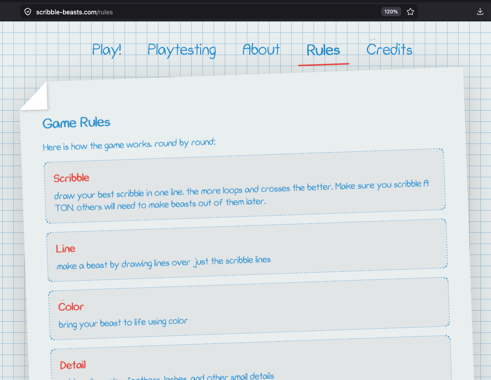

# CS5002 Final Design Report: Scribble Beasts

## Table of Contents

1. [Project Description](#1-project-description)
2. [User Interface Specification](#2-user-interface-specification)
3. [Test Plan and Results](#3-test-plan-and-results)
4. [User Manual](#4-user-manual)
5. [Spring Final PPT Presentation](#5-spring-final-ppt-presentation)
6. [Final Expo Poster](#6-final-expo-poster)
7. [Assessments](#7-assessments)
8. [Summary of Hours and Justification](#8-summary-of-hours-and-justification)
9. [Summary of Expenses](#9-summary-of-expenses)
10. [Appendix](#10-appendix)

## 1. Project Description

### Team

- [Jasmine Mogadam](documents/biographies/jasmine-mogadam-bio.md) - Computer Science Major - mogadajh@mail.uc.edu
- [Ana Cedillo](documents/biographies/ana-cedillo-bio.md) - Computer Science Major - cedillak@mail.uc.edu
- [Ethan Chaplin](documents/biographies/ethan-chaplin-bio.md) - Computer Science Major - chapliep@mail.uc.edu

### Advisor

- [Badri Vellambi](https://researchdirectory.uc.edu/p/vellambn) - Associate CEAS Professor - vellambn@ucmail.uc.edu

### 400-Character Abstract

Scribble Beasts is a multiplayer browser game where players collaboratively transform scribbles into complete creatures through timed rounds for lines, color, details and naming. Teams then pitch how their beast survives an apocalypse scenario and vote on winners. The final system runs as a Svelte client and Node/WebSocket server, containerized with Docker and deployed on Fly.io for all playtests.

### Final Project Description

Scribble Beasts solves common party-game friction points by removing controller requirements, local-device limits, and physical art supply constraints. One host creates a room, players join from their own devices, and each round rotates artwork so every participant contributes to every beast.

### Design Decisions and Techniques

- WebSocket-first architecture was selected for low-latency multiplayer synchronization across game rounds.
- Dockerized client/server services with Nginx reverse proxy were used to keep local and deployed environments consistent.
- Shared TypeScript modules were used to reduce client/server schema drift for actions and game-state structures.
- Production deployment moved from local compose-style orchestration to Fly.io app deployments for better operational safety.

### Final Specifications

- Frontend: Svelte + TypeScript
- Backend: Node.js + `ws` + TypeScript
- Infrastructure: Docker, Nginx, Fly.io
- Multiplayer model: room-based, host-controlled flow, browser-only clients

Final-state implementation highlights:

- Real-time gameplay with WebSocket room management and synchronized round transitions.
- Multi-round collaborative drawing pipeline (scribble, line, color, detail, name, presentation, voting, winner).
- Accessibility and quality-of-life options such as host settings, captions, and round controls.
- Dockerized client/server architecture with Nginx routing and Fly.io deployment.

Supporting documents:

- [User Stories](documents/User_Stories.md)
- [Design Diagrams](documents/Design_Diagrams/Design_Diagrams.md)
- [Task List](documents/essays/Tasklist.md)
- [Timeline](documents/timeline.md)
- [Milestones](documents/milestones.md)

## 2. User Interface Specification

The interface is designed around fast onboarding and low-friction multiplayer use on desktop and mobile browsers.

Core UI flow:

1. Landing page for room creation/join.
2. Lobby with host controls and player list.
3. Round interfaces for drawing, text naming, presentation, and voting.
4. Winner/podium results and replay path.

UI references:

- [UI Design Diagrams](documents/Design_Diagrams/Design_Diagrams.md)
- [Online User Manual with screenshots](documents/user_manual.md)

## 3. Test Plan and Results

### Test Plan

- Full test design and matrix: [Scribble Beasts Test Plan](documents/testplans/testplan.md)
- Test strategy covers unit, integration, and functional cases for room management, round flow, edge cases, and reliability behavior.

### Executed Test Results

Executed on April 15, 2026 from repository root using:

```bash
npm test
```

Results:

- Client test suite: 1/1 tests passed.
- Server test suite: 17/17 tests passed.
- Total automated tests passed: 18/18.

Notes:

- Vitest reported one Svelte warning in `DrawingRound.svelte` about a self-closing non-void `label` tag.
- Warning does not fail tests, but should be cleaned up in a future polish pass.

## 4. User Manual

- [Online User Manual (repo)](documents/user_manual.md)
- Live game deployment used for playtests: <https://scribble-client-jazmo.fly.dev>
- End-user guide screenshot: [userguide-img.png](documents/userguide-img.png)



FAQ is included directly in the user manual:

- [Jump to FAQ](documents/user_manual.md#faq)

## 5. Spring Final PPT Presentation

- [Spring Final PPT Presentation](https://docs.google.com/presentation/d/18-QyqXY7taJ1myYvVH_GkVbm9iNFZ_A1/edit?usp=drive_link&ouid=103739955886447715192&rtpof=true&sd=true)

## 6. Final Expo Poster

- [Scribble Beasts Final Expo Poster (PDF)](documents/Scribble%20Beasts%20Expo%20Poster.pdf)

## 7. Assessments

### 7.1 Initial Self-Assessments (Fall)

- [Jasmine Mogadam - Initial Assessment](documents/essays/mogadajh-individual-capstone-assessment.md)
- [Ana Cedillo - Initial Assessment](documents/essays/ana-cedillo-individual-capstone-assessment.md)
- [Ethan Chaplin - Initial Assessment](documents/essays/ethan-chaplin-individual-capstone-assessment.md)

### 7.2 Final Self-Assessments (Spring)

- [Jasmine Mogadam - Final Spring Self-Assessment](documents/essays/mogadajh-final-self-assessment-spring.md)

## 8. Summary of Hours and Justification

- [Fall + Spring Hours and Justification by Team Member](documents/spring_hours_and_justification.md)

## 9. Summary of Expenses

- [Summary of Expenses and Donated Services](documents/budget.md)

## 10. Appendix

### References and Supporting Links

- Code repository: <https://github.com/Jasmine-Mogadam/CS5001-Scribble-Beasts>
- Project board and issue tracking: <https://github.com/orgs/2025-Senior-Design-Project/projects/2>
- Test plan: [documents/testplans/testplan.md](documents/testplans/testplan.md)
- Timeline: [documents/timeline.md](documents/timeline.md)
- Task list: [documents/essays/Tasklist.md](documents/essays/Tasklist.md)
- User manual: [documents/user_manual.md](documents/user_manual.md)
- Meeting notes and cadence summary: [documents/meeting_notes.md](documents/meeting_notes.md)

### Evidence of Effort

Evidence supporting team effort totals includes:

- Task tracking and ownership in the GitHub project board.
- Source control commit history and pull request review activity.
- Weekly meeting cadence and playtest sessions documented in appendix notes.

### Spring Repository Activity Metrics

Metrics window: January 1, 2026 to April 15, 2026.

| Team Member | Commits | Active Weeks with Commits | Avg Commits/Week | Avg Commits/Active Week | `.ts/.tsx/.svelte` Added | `.ts/.tsx/.svelte` Deleted | Net |
| --- | ---: | ---: | ---: | ---: | ---: | ---: | ---: |
| Jasmine Mogadam | 17 | 5 | 1.13 | 3.40 | 6467 | 788 | 5679 |
| Ana Cedillo | 1 | 1 | 0.07 | 1.00 | 333 | 105 | 228 |
| Ethan Chaplin | 4 | 4 | 0.27 | 1.00 | 740 | 76 | 664 |

Method note:

- Commit counts/frequency were computed from Git history in the Spring window above.
- Line stats include only files with extensions `.ts`, `.tsx`, and `.svelte`.
