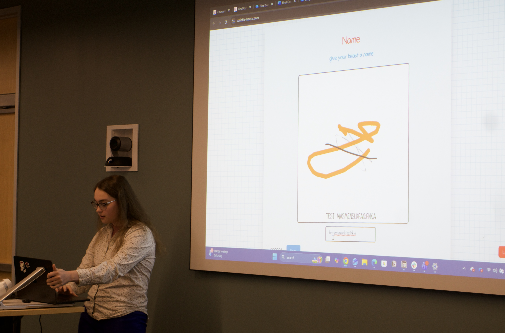

# Scribble Beasts User Manual

## Access

- Live URL: <https://scribble-client-jazmo.fly.dev>
- Supported platforms: modern desktop/mobile browsers with JavaScript enabled.

## Quick Start

1. Open the live URL.
2. Enter a player name and room name.
3. Select `Create Room` (host) or `Join Room` (player).
4. Host starts the game from the lobby.
5. Complete each timed round as prompted.
6. Present your beast in the apocalypse round and vote.

## Host Controls

- Start game from lobby.
- Configure settings (for example self-vote, tutorial/intro options, audio/caption behavior).
- Manage replay flow after winner announcement.

## Round Overview

1. Scribble: create a base sketch.
2. Line: add linework to a teammate's image.
3. Color: fill color layers.
4. Detail: add visual details.
5. Name: type a name for the beast.
6. End-of-the-World: receive scenario prompt.
7. Presentation: pitch why your beast solves the scenario.
8. Voting/Winner: vote and view podium.

## Screenshots

- Rules page from hosted manual: 
- Landing and room flow reference: 
- In-project screenshot reference: 

## Troubleshooting

- If joining fails, verify exact room name and host availability.
- If canvas input is not detected on mobile, refresh and rejoin.
- If audio is not desired, adjust room/personal sound settings.
- If connection is lost, refresh and re-enter room while it is still active.

## FAQ

### What devices can we use?

Any device with a modern browser (phone, tablet, laptop, desktop).

### Do all players need downloads or accounts?

No. Players only need the URL and a room name.

### How many players are supported?

Gameplay supports two or more players. Best experience is with small groups.

### Can players join after a game starts?

Late join behavior is restricted during active rounds to preserve game state.

### How are winners decided?

Players vote during the voting round, and the highest-voted beast wins.
